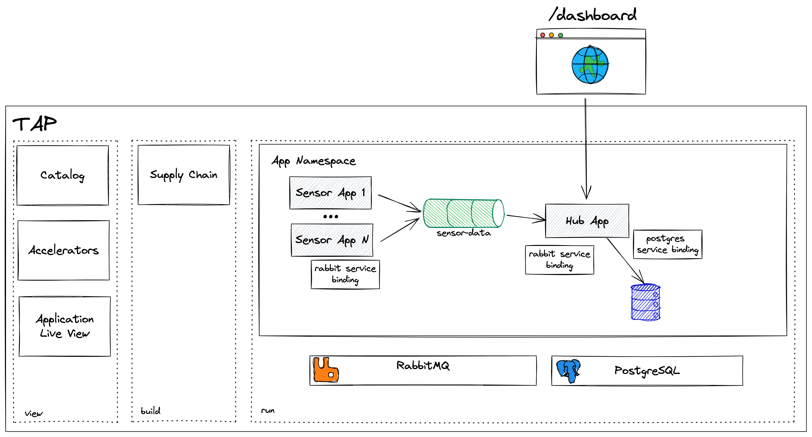

# TAP Sensors Demo App (TAP Developer Sandbox version)

An application to demonstrate the capabilities of [VMware Tanzu Application Platform](https://tanzu.vmware.com/application-platform).

This application consists of two services:
- Sensor service(s), which periodically publishes events with sensor data
- Hub service, which consumes sensors' events and stores data in its database; also comes with a web dashboard

Features:
- [Spring Cloud Stream](https://spring.io/projects/spring-cloud-stream), a framework built on top of Spring Boot
  and Spring Integration, is used as a flexible messaging abstraction. Spring Cloud Stream supports a variety of binder
  implementations. In this case, we are using the one for RabbitMQ.
- Service Bindings - binding an application workload to a backing service such as a RabbitMQ is one of the most
  important use cases within the context of the VMware Tanzu Application Platform. This use case is made possible
  by the [Service Binding Specification](https://github.com/servicebinding/spec) for Kubernetes. With the service
  binding that is defined in the workload.yml (found under config folder in the respective app), the credentials that
  are required for the connection to the RabbitMQ cluster or PostgreSQL are magically injected into the container
  and the Spring Boot application.




## Prerequisites

- Access to an instance of VMware Tanzu Application Platform (`dev`, `light` or `full`)
- A namespace
- Privileges of an app operator, to claim services

## Backing services:

The following backing services are required:

1. `sensors-rabbitmq` : a RabbitMQ service for the Sensor microservice to publish its measurements to. The Hub application subscribes to these measurements and stores them
1. `sensors-db` : a PostgreSQL database used to store sensor data
1. `appsso`: AppSSO is an abstraction provided by TAP over your platform's SSO Providers. Authentication-aware apps need to have their own bindings:
   - `hub-appsso-claim` registers the `Hub` microservice with AppSSO
   - `gateway-appsso-claim` registers the `Gateway` as an OAuth2 Client

In order to instantiate claims for each of these microservices, run:


## Deploying Application Workloads

```shell
kubectl apply -f config/app-operator/backing-services
```

This will apply each of the service claim definitions to the running cluster.


### Sensor service
To deploy the sensor service, execute the following command:
```shell
tanzu apps workload apply -f sensor/config/workload.yml
```

### Hub service
To deploy the hub service, execute the following command:
```shell
tanzu apps workload apply -f hub/config/workload.yml
```

### API Gateway
To deploy the API Gateway, execute the following command:
```shell
tanzu apps workload apply -f gateway/config/workload.yml
```

### UI
To deploy the frontend UI app, execute the following command:
```shell
tanzu apps workload apply -f ui/config/workload.yml
```

Once the workloads are finished running, you may access the application by navigating to the Gateway's URL. 

## Running on local

### Prerequisites

- Java Development Kit (JDK) 17 or newer
- Docker Desktop / Rancher Desktop for running RabbitMQ and PostgreSQL services

**Note**: all listed commands assume that you are running them from the root folder of the project

### Starting RabbitMQ and PostgreSQL services

**Pre-req**: Make sure your Docker/Rancher Desktop is running.

For your convenience, this project comes with [docker-compose.yml](docker-compose.yml) file that allows you to start
all the required services. To make it even easier, you can find scripts in the [bin](bin) folder:

To start both services, run
```shell
bin/services-up
```

To shut both services down, run:
```shell
bin/services-down
```

### Start both hub and sensor services
**Pre-req**: Make sure RabbitMQ and PostgreSQL services are running as docker containers (`docker compose ps`)

For your convenience, we provided a script that allows you to start both services:
```shell
bin/run
```

You can also run individual services with these commands
```shell
./gradlew hub:bootRun
./gradlew sensor:bootRun
```

### Validate the application is working

#### Sensor service
After the sensor service starts successfully it generates a sensor event every second. Each time a sensor event is
emitted it logs detail of that event. Check the console for logs.

Also, the service has healthcheck endpoint: [http://localhost:8081/actuator/health](http://localhost:8081/actuator/health)

#### Hub service
Every time the hub service receives a sensor event, it logs details of that event. Assuming your sensor service is
running and emitting events, your hub service should receive them and log them. Check the console for logs.

Also, the service has healthcheck endpoint: [http://localhost:8080/actuator/health](http://localhost:8080/actuator/health)

Finally, you can open [Hub's dashboard](http://localhost:8080/) in your browser, and you should see a table
containing realtime sensor data (refreshes every few seconds).
